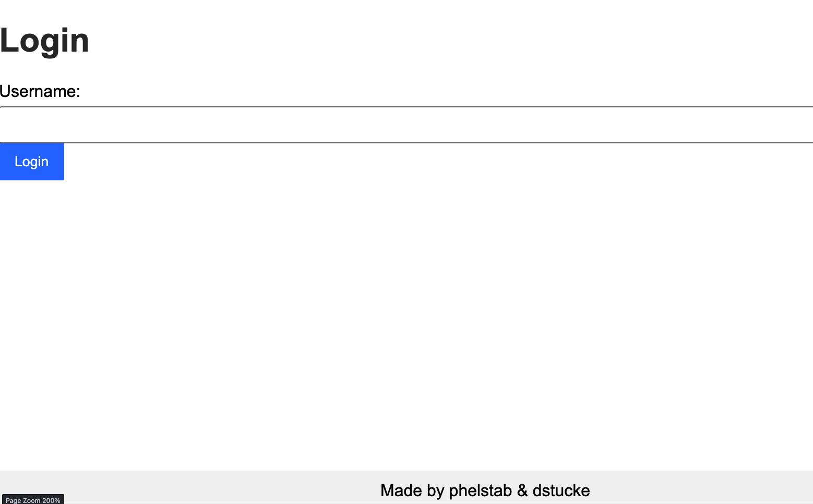
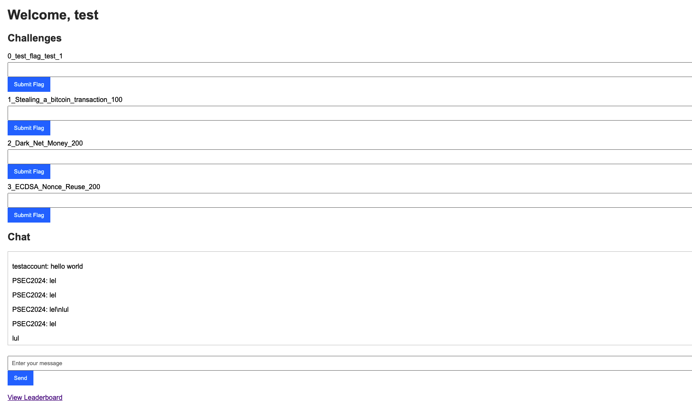
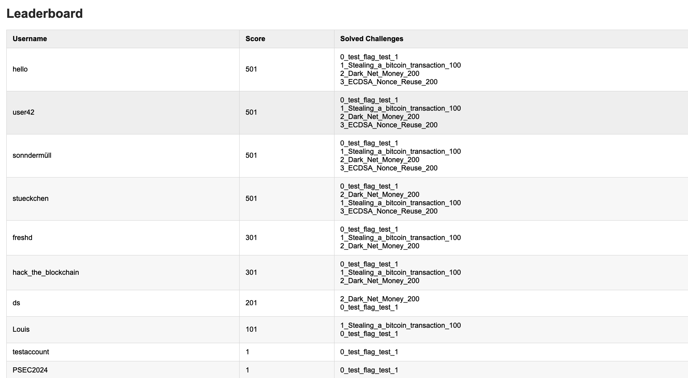

= Very minimalistic CTF Panel for UUlm Practical Cybersecurity Lab.

== Introduction

== Installation

[source,bash]
----
python -m venv venv
pip install -r requirements.txt
----

== Usage

[source,python]
----
python app.py
----

== License
MIT
Made by phelstab & dstucke.